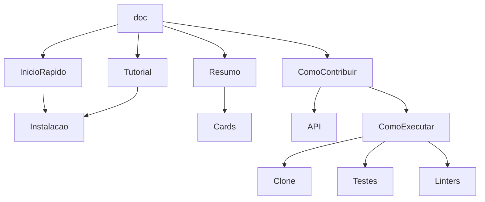

# Documentação

## Resumo/Página inicial/Readme (repo)

### Cards

* Cards para levar para lugares específicos da documentação
  * Início rápido
  * Tutorial
  * Como contribuir

## Inicio Rápido

* Contexto sobre a aplicação
  * Subcomandos do CLI
* Como instalar
  * pip install ...
* Como executar
  * Gancho com o contexto e uma explicação básica de cada comando
  * Help

## Tutorial

* Detalhar os objetivos
* Instalação
  * pip install ...
* Explicar cada subcomando
  * Variações dos comandos
  * Aproveitar dos recursos gráficos
    * Imagens e vídeos
* Problemas comuns (???)

## Como contribuir

* Como executar o projeto
  * Como fazer o clone
  * Como rodar os testes
  * Como rodar os linters
  * Descrição dos módulos
    * Aponta para a documentação da API
* Dicas de contribuição (com referências)
  
  Dizer onde está, uma referência
  * Implementar escalas
    * Wikipedia das escalas
  * Classes customizadas de Erros
    * NotaErro
  * Progressões harmônicas
  * Implementação de acordes
    * Implementação de tríades
      * sus4
      * sus9
    * Implementação de tétrades
      * Acordes com 7
      * Acordes com 9
  * Funções harmônicas
    * Tônica
    * Dominante
    * Subdominante
    * Relativos

## API

* Explicar os módulos

--- 

## Parte técnica

* Macros: Não repita comandos que podem se modificar
* Templates: Para que blocos de documentação repetidos não sejam duplicados em vários lugares
* Cards: HTML e CSS